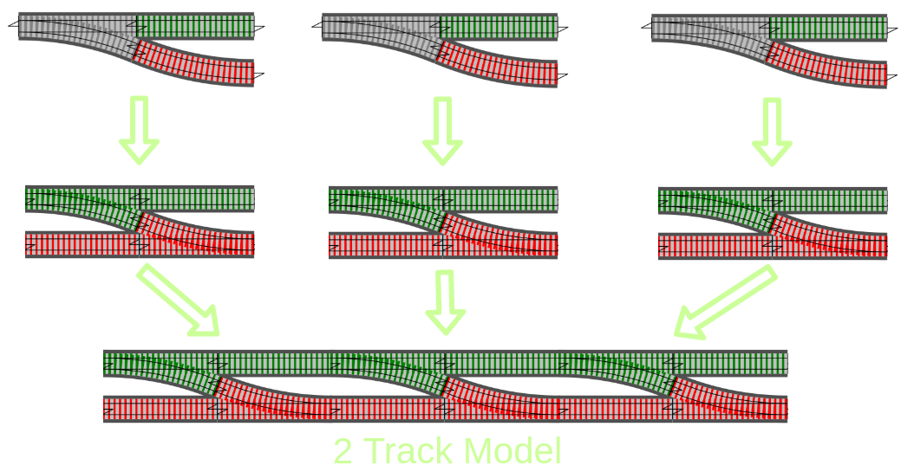

<!-- .slide: data-background-image="resources/railway.jpg" data-background-size="cover" data-state="dimmed"-->

## Railway Oriented Programming
### komplexe Orchestrierung wartbar machen


Patrick Drechsler

`#etka18`

- <i class="fa fa-calendar" aria-hidden="true"></i> 21.06.2018
- <i class="fa fa-twitter" aria-hidden="true"></i> @drechsler

x---

**Patrick Drechsler**

- "gelernter" Biologe
- C# Entwickler
- Schwerpunkte: DDD, FP
- Softwerkskammer

Note:

Ueberleitung: Keine Monaden

x---

## Disclaimer

Ich werde nicht erklären, was eine Monade ist

> Wenn man verstanden hat, was eine Monade ist, verliert man die Fähigkeit zu erklären, was eine Monade ist.

(Monaden-Paradoxon)

Note:

- Umfrage:
    - C#
    - Java
    - Andere?
- Alle Beispiele sind in **C#**
- (geht aber auch alles mit Java)

x---

Video: 

Scott Wlaschin ("Mr. F#") on Monads

 (2min)

x---

<!-- .slide: data-background-video="resources/wlaschin-monads.mp4" data-background-size="cover" -->

x---

Begriffe wie Functor, Monoid und Monade

brauchen wir nicht

x---

# Wir sind faul

## wartbaren Code schreiben!

(dein zukünftiges Ich wirds dir danken)

x---

### Was ist "Orchestrierung"?

Code
- mit wenig interner Logik
- bei dem viel "zusammenläuft":
    - viele Abhängigkeiten
    - oft in "Service" Klassen (z.B. RegistrationService)
    - beschreibt oft den Ablauf einer User Story...


x---

### User Story: Anmeldung als neuer Benutzer
Wenn ein neuer Benutzer sich anmeldet,
- werden seine Eingaben validiert
- wird er im System gespeichert
- erhält er eine Bestätigungsmail

x---

Unser Ziel:

```csharp
var customerResult = Validate(createCustomerViewModel);
var result = customerResult
    .OnSuccess(c => _customerRepository.Create(c))
    .OnSuccess(c => _mailConfirmer.SendWelcome(c))
    .OnBoth(resultAtEnd => resultAtEnd.IsSuccess
        ? new CustomerCreatedViewModel(resultAtEnd.Value.Id)
        : CreateErrorResponse(resultAtEnd.Error));
```

x---

<pre>
<code data-noescape data-trim class="lang-csharp hljs">
<span class="my-semi-hide-always fragment" data-fragment-index="1">public CustomerCreatedViewModel RegisterCustomer(SomeVM viewModel)</span>
<span class="my-semi-hide-always fragment" data-fragment-index="1">{</span>
    var customer = Validate(viewModel);
    customer = _customerRepository.Create(customer);
    _mailConfirmer.SendWelcome(customer);

    <span class="my-semi-hide-always fragment" data-fragment-index="1">return new CustomerCreatedViewModel(customer);</span>
<span class="my-semi-hide-always fragment" data-fragment-index="1">}</span>    
</code>
</pre>

- Cool, wir sind fertig! <!-- .element: class="fragment" data-fragment-index="2" -->
- let's go live... <!-- .element: class="fragment" data-fragment-index="2" -->

x---

<section>
    <h2 style="color:darkred">...No error handling...</h2>
    <h1 style="color:darkred">What could possibly go wrong?</h1>
</section>

x---

*...potentielle Fallstricke...*
<pre>
<code data-noescape data-trim class="lang-csharp hljs">
<span class="mycodemark-highlight">// can fail</span>
var customer = Validate(createCustomerViewModel);

<span class="mycodemark-highlight">// can fail</span>
customer = _customerRepository.Create(customer);

<span class="mycodemark-highlight">// can fail</span>
_mailConfirmer.SendWelcome(customer);

return new CustomerCreatedViewModel(customer.Id) {Success = <span style="color:black;font-weight:bold">??</span>};
</code>
</pre>

Note:
- Uebergang: ACHTUNG! Erst nachdenken!!

x---

### Pro-Tipp

#### Gewünschtes Fehlerverhalten abklären

- Nicht einfach drauflos programmieren:<!-- .element: class="fragment" data-fragment-index="1" -->
    - Zuerst mit Kunde/Domain-Experten klären!
    - Dann die User Story aktualisieren (oder neue User Story für Fehlerfälle erstellen)

x---

## Fehlerbehandlung

<pre>
<code data-noescape data-trim class="lang-csharp hljs">
<span class="mycodemark-always-error-handling">Customer customer;
try {</span> <span class="mycodemark-always">customer = Validate(createCustomerViewModel);</span> <span class="mycodemark-always-error-handling">}
catch (Exception e) { return CreateErrorResponse(e); }

try {</span> <span class="mycodemark-always">customer = _customerRepository.Create(customer);</span> <span class="mycodemark-always-error-handling">}
catch (Exception e) { return CreateErrorResponse(e); }

try {</span> <span class="mycodemark-always">_mailConfirmer.SendWelcome(customer);</span> <span class="mycodemark-always-error-handling">}
catch (Exception e)
{
    // don't fail, but maybe: logging, retry-policy
}
</span>
<span class="mycodemark-always">return new CustomerCreatedViewModel(customer.Id);</span>
</code>
</pre>

Note:
- Code ist schwerer zu lesen/warten
- (Trotz kompakter Darstellung)

x---

- **Fehlerbehandlung macht einen Großteil des Codes aus**
- Ergebnis einer Aktion ist oft Grundlage für weitere Aktion
- Exceptions: **`throw`** ist schlimmer als **`goto`**!

x---

### Funktionale Programmierung

- Pure Functions<!-- .element: class="fragment" data-fragment-index="1" -->
    - gleiche Eingabe gibt immer gleiches Ergebnis zurück<!-- .element: class="fragment" data-fragment-index="2" -->
    - keine Seiteneffekte<!-- .element: class="fragment" data-fragment-index="3" -->
- Higher Order Functions<!-- .element: class="fragment" data-fragment-index="4" -->
    - Funktionen können als Eingabe- und Rückgabewert verwendet werden

Note:

- Achtung: FP Puristen sprechen auch von Typed FP


x---
<!-- .slide: data-background-image="resources/sheldon-cooper.jpg" data-background-size="cover" data-state="dimmed"-->
### Where are the railways?
## You promised trains!

x---


x---


x---


x---


x---

einfach: F2 kann Failure empfangen:


x---

dann kann man weiterarbeiten:


x---

Ups: F2, F3 können keinen Fehler entgegennehmen:


x---

wir brauchen eine Funktion, die Fehler entgegennimmt:


x---

Umwandeln von 1-Track Input in 2-Track Input mit einem **"Adapter Block"**


x---



x---

**"Result"** kapselt Success und Failure


x---

- **"Result"** ist kein Sprachfeature von C# / Java <i class="fa fa-frown-o" aria-hidden="true"></i>
- C# 
    - [CSharpFunctionalExtensions *](https://github.com/vkhorikov/CSharpFunctionalExtensions)
    - [LaYumba.Functional](https://github.com/la-yumba/functional-csharp-code)
    - [language-ext](https://github.com/louthy/language-ext)
- Java: [auch möglich (Link im Abspann)](https://www.heise.de/developer/artikel/Railway-Oriented-Programming-in-Java-3598438.html)
- F#: Sprachfeature

<i class="fa fa-smile-o" aria-hidden="true" style="font-size:2em"></i>

x---

Basteln wir uns ein **Result**...

x---

### "Result zu Fuß"...

```csharp
public class Result {
    public bool Success { get; }
    public string Error { get; }

    protected Result(bool success, string error) { /* … */ }

    public static Result Fail(string message) { /* … */ }

    public static Result<T> Ok<T>(T value) {  /* … */ }
}
```

```csharp
public class Result<T> : Result {
    public T Value { get; }
    public bool IsFailure => !Success;

    protected internal Result(T value, bool success, string error)
        : base(success, error) {
        Value = value;
    }
}
```

Note:

- 1min Anschauen: Wir wissen nicht, was wir damit machen koennen!

x---

### Erstellen von Result

```csharp
public Result<Customer> Validate(Customer customer) {

    return IsValid(customer)
        ? Result.Ok(customer)    // <- static ctor for success
        : Result.Fail("invalid") // <- static ctor for failure
}
```

x---

# Live Coding

(Result Klasse zu Fuß)


x---


x---

### Kombination von Results

(via Extension Methods)

- **OnSuccess**
- **OnBoth**
- **OnFailure**

Hinweis: Extension Methods in C# sind wie "traits" (Scala) oder "mixins" (Ruby)

x---

### Verketten von Result

```csharp
static Result<U> OnSuccess(this R<T> result,
                        Func<T, U> func) { /*...*/ }
```
```csharp
static Result<T> OnFailure<T>(this Result<T> result, 
                        Action<string> action) { /*...*/ }
```
```csharp
static K OnBoth<T, K>(this Result<T> result, 
                        Func<Result<T>, K> func) { /*...*/ }
```

x---

# Live Coding

(Beispielcode)

x---

Ausblick: **F#**...

x--

Result ist mittlerweile ein Sprachfeature von F#, kann aber auch einfach selbst implementiert werden:

```fsharp
// discriminated union
type Result<'TSuccess,'TFailure> = 
    | Success of 'TSuccess
    | Failure of 'TFailure
```

x--

```fsharp
let bind switchFunction twoTrackInput = 
    // Pattern Matching
    match twoTrackInput with
    | Success s -> switchFunction s
    | Failure f -> Failure f
```
**`bind`** kombiniert zwei 2-Track Funktionen`...`

(entspricht OnSucces, OnFailure, Onboth)

x--

Anwendungsbeispiele

```fsharp
type Request = {name:string; email:string} // <- Record type

let validate1 input =
   if input.name = "" then Failure "Name must not be blank"
   else Success input

let validate2 input =
   if input.name.Length > 50 then Failure "Name must not be longer..."
   else Success input

let validate3 input =
   if input.email = "" then Failure "Email must not be blank"
   else Success input
```

x--

```fsharp
// Option 1
let combinedValidation = 
    let validate2' = bind validate2
    let validate3' = bind validate3
    validate1 >> validate2' >> validate3' 
```

```fsharp
// Option 2
let combinedValidation = 
    validate1 
    >> bind validate2 
    >> bind validate3
```

```fsharp
// Option 3
let combinedValidation = 
    validate1 
    >=> validate2 
    >=> validate3 
```

<a class="small" href="https://fsharpforfunandprofit.com/posts/recipe-part2/">https://fsharpforfunandprofit.com/posts/recipe-part2/<a>

x---

Haben wir unser Ziel erreicht?

```csharp
var customerResult = Validate(createCustomerViewModel);
var result = customerResult
    .OnSuccess(c => _customerRepository.Create(c))
    .OnSuccess(c => _mailConfirmer.SendWelcome(c))
    .OnBoth(resultAtEnd => resultAtEnd.IsSuccess
        ? new CustomerCreatedViewModel(resultAtEnd.Value.Id)
        : CreateErrorResponse(resultAtEnd.Error));
```

x---

## Fazit: Railway Oriented Programming

- lesbarer & wartbarer Code
- kompakte Fehlerbehandlung
- **Fehlerbehandlung wird Bestandteil der Domäne!**

...nebenbei haben wir Sinn und Zweck der "Either-Monade" verstanden... <i class="fa fa-smile-o" aria-hidden="true"></i>

x---
<!-- .slide: class="too-much-content" -->
## Links

- Scott Wlaschin "the original talk" http://fsharpforfunandprofit.com/rop/
- Stefan Macke "ROP für Java" https://www.heise.de/developer/artikel/Railway-Oriented-Programming-in-Java-3598438.html
- Vladimir Khorikov "Functional C#: Handling failures" http://enterprisecraftsmanship.com/2015/03/20/functional-c-handling-failures-input-errors/
- C# Bibliotheken
    - CSharpFunctionalExtensions https://github.com/vkhorikov/CSharpFunctionalExtensions
    - LaYumba.Functional https://github.com/la-yumba/functional-csharp-code
    - language-ext https://github.com/louthy/language-ext

x---

# Danke!

- <i class="fa fa-envelope" aria-hidden="true"></i>&nbsp;patrick.drechsler@redheads.de
- <i class="fa fa-twitter" aria-hidden="true"></i>&nbsp;&nbsp;@drechsler
- <i class="fa fa-github" aria-hidden="true"></i>&nbsp;&nbsp;draptik
